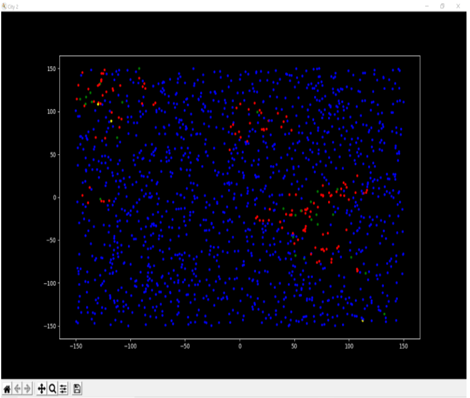
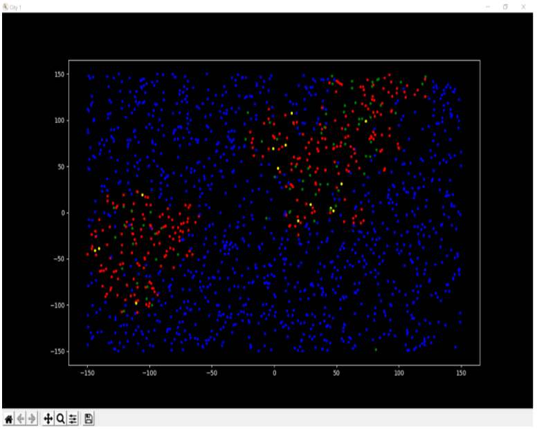

# SIR-MODEL-USING-PYTHON
This project includes an agent – based SIR model to simulate the transmission of viral vectors within a community.

Key features of this project :: 
It implements a comparison based simulation in two situations with some constraints that represent mitigation policies which includes-
    mask wearing# SIR-MODEL-USING-PYTHON

This project includes an agent–based SIR model to simulate the transmission of viral vectors within a community.

##  Key features of this project :: 
#### It implements a comparison based simulation in two situations with some constraints that represent mitigation policies which includes-
#####           mask wearing
#####           social distancing 
#####           sanitary hygiene etc.       
#### It analyzes a viral pandemic situation like Covid – 19 using the real data.
#### It also visualizes the simulation using various libraries available in python.
#### It analysis a viral pandemic situation like Covid – 19 using the real data.

## Screenshots
 
  
 #### SITUATION-1 : With all constraints like mask wearing,social distancing,sanitary hygiene etc. 
 
 #### SITUATION-2 : Without any constraints 
 
 

